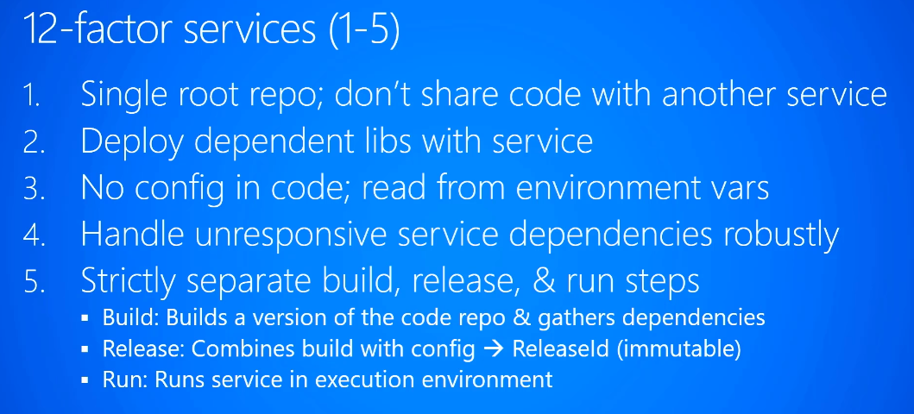
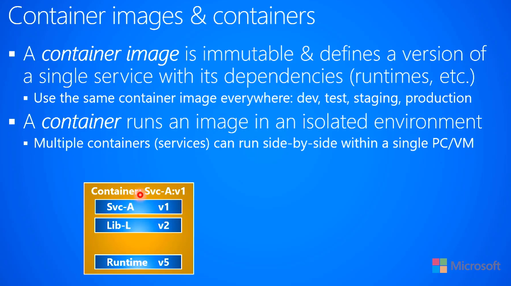

### Orchesterator:

- Manages cluster of hardware and their lifecycles
- Manages the health monitoring of various things running
- Manage scale - add/remove instances of the services
- Detects the crash and restart the service
- If the resource is not available, informs the load balancer of the situation (so that new requests can be sent to remaining resources)
- If new machine (resource) is available, inform load balancer, so that the new resource can be used
- Can support auto-scaling based on the load on the existing resources

### Overall Architecture:

Each service solves its own domain specific problem and has exclusive access to its own data storage

You may need to separate services for various reasons
-	Can scale independently
-	Can use different technology stacks (e.g. .Net vs Java)
-	More than one clients want to use the same service (in which case, we can separate it as a service) We can version the service in case changes are needed
-	May need different version of technology to be loaded for different version of services 

### Autoscale services

- 	Check the queued messages and scale up if the queue is having larger backlog
-	Check resource usage and scale up if resource usage is higher
-	Based on schedule/load estimate, proactively upscale

### 12factor.net

### Networking:

