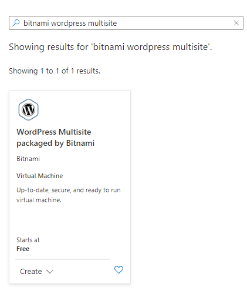
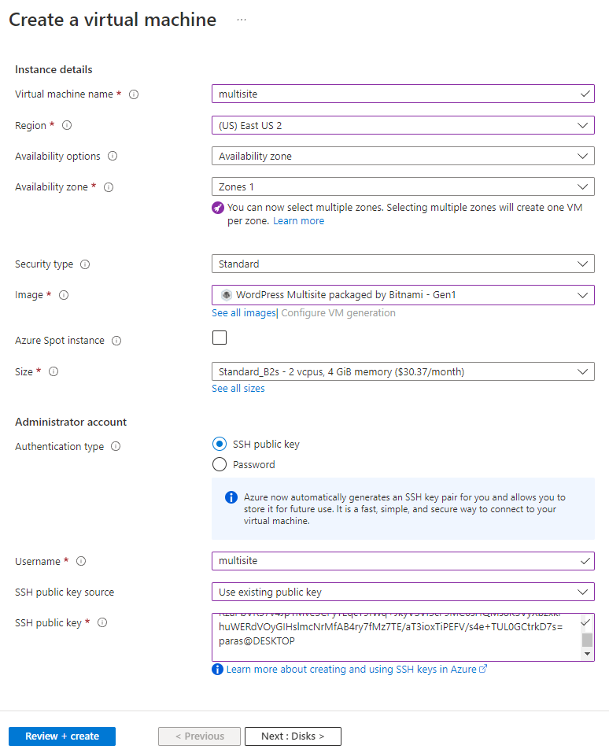
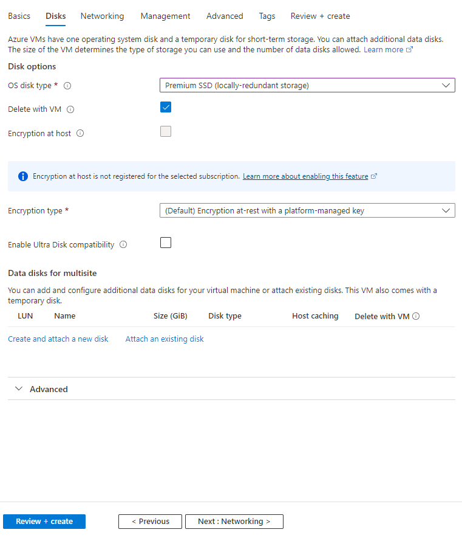
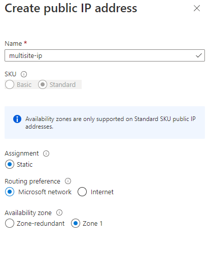
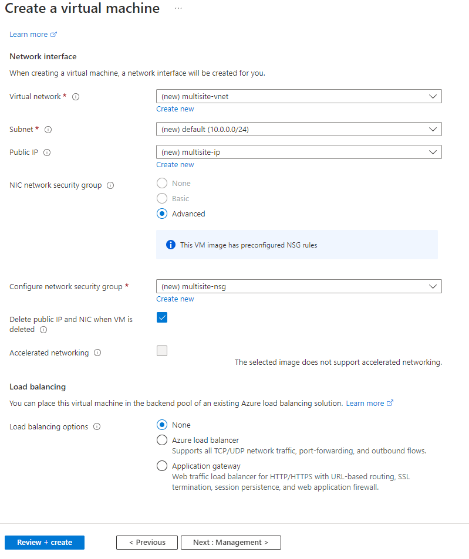

### Steps to create Bitnami Wordpress Multi-site

- Go to Azure portal
- Select "create a resource"
- Search for "Bitnami wordpress multisite"



- Before you create the machine, generate a SSH Key

  - Open command prompt with Admin rights
  - Go to the folder where you need certificate
  - run command "ssh-keygen"
  - Give the name of the file
  - File without extension is the private key. With .pub extension is the public key

- In the create virtual machine parameters, select the following

  - size

  - SSH public key source = existing key (and put in the public key there)

    



- In the Networking section
  - Select "Public IP" - Create new





- Management

  - Disable "auto-shutdown"

- Advanced - no change

  ### Steps after resource is created

- Go to the Virtual Machine created

- Confirm that it has public IP address

- Click on DNS name

  - Add the available dns name (e.g. multisite)

- Connect to the machine using SSH

  - ssh -i .\multisite multisite@multisite.eastus2.cloudapp.azure.com

- Get and save the username/password

  - sudo cat bitnami_credentials
  - Same password to access the databases and any other component the stack includes

- Follow the bitnami document to configure it:

- https://docs.bitnami.com/aws/apps/wordpress-multisite/configuration/configure-wordpress-multisite/#add-several-wordpress-multisite-blogs-with-different-domains

- When you test it, it will say "Approach A: Using system packages."

- Associate any domain name to it

  ```shell
  sudo /opt/bitnami/configure_app_domain --domain our-planets.com
  ```

- Add the IP address of your new virtual machine as "A" record in the DNS manager with your domain registrar

- Confirm that you can go to the WordPress dashboard by going to

  - www.yoursite.com/wp-admin/
  - use the username/password that you got earlier from the bitnami_credentials

- For cookie management, add the lines to the file:

  - /opt/bitnami/wordpress/wp-config.php

    #### start: fixes for cookies issues with multiple domains

      define( 'COOKIE_DOMAIN', '' );
      define( 'ADMIN_COOKIE_PATH', '/' );
      define( 'COOKIEPATH', '/' );
      define( 'SITECOOKIEPATH', '/' );

    #### end:   fixes for cookies issues with multiple domains

- To add the free SSL certificate to the site(s)

  - go to folder /opt/bitnami
  - Run command "sudo ./bncert-tool"
  - Provide list of all the sites (without www) separated by space
  - Also when asked question to automatically add for "www", say yes

- Forward all the HTTP traffic to HTTPS 

  - https://docs.bitnami.com/general/infrastructure/lamp/administration/force-https-apache/

- 

  